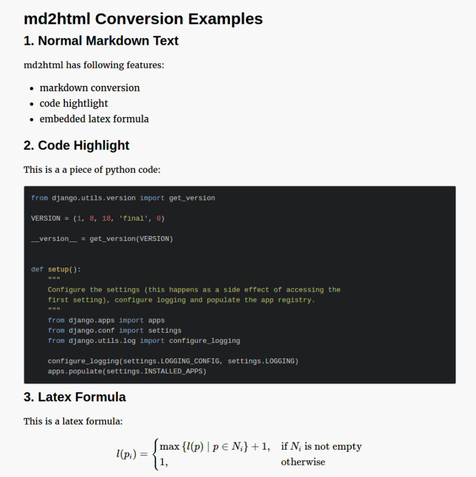

# md2html

md2html is a tool to conver markdown file into html file. Besides markdown conversion, md2html also support embedded latx formula conversion and code highlight.

## Install

```shell
$ npm install md2html-plus -g
```

## Usage

```shell

  Usage: md2html [options] <markdown-file ...>


  Options:

    -V, --version         output the version number
    -w, --with-html-head  wrap generated html file with html tag.
    -h, --help            output usage information

```

## Example

There is example markdown file in directory examples directory, let's see the result after conversion.

Conver markdown file into html file:

```shell
$ md2html -w examples/examples.md
```

and the result html:


